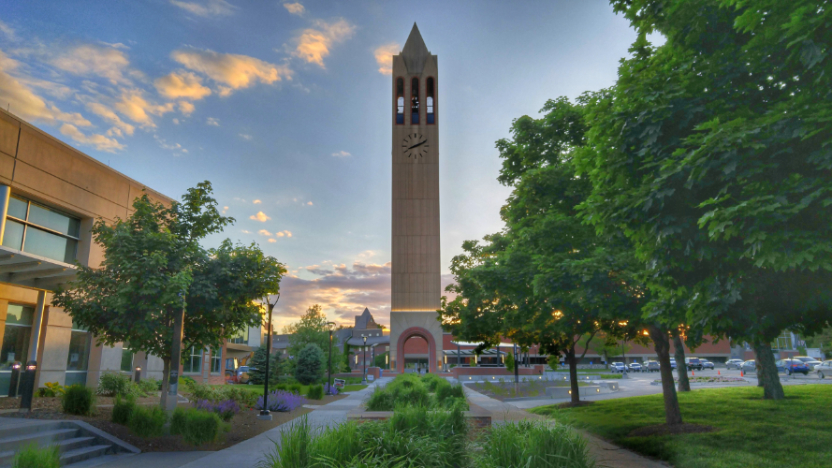
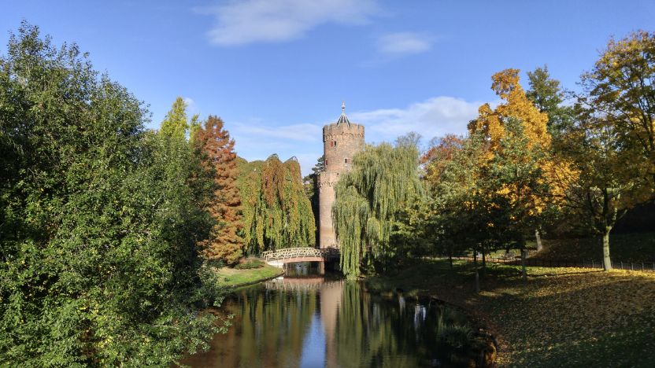
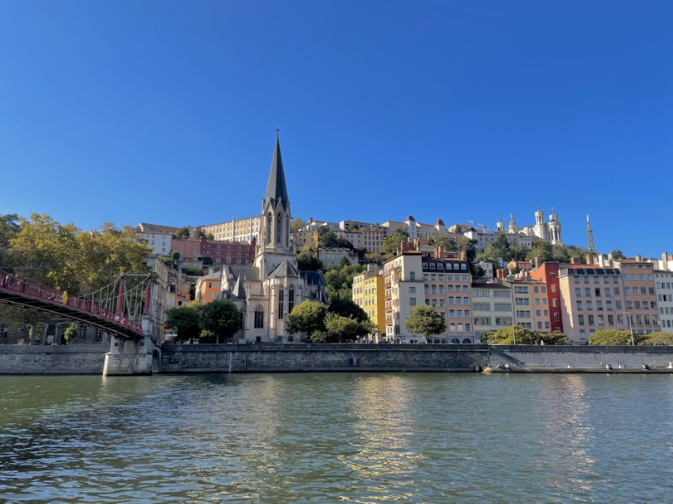
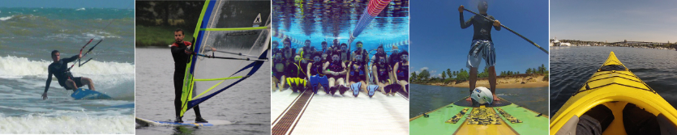

Here is my short bio. If you are looking for my resume/CV, you can [download it here](assets/Matheus_Amazonas_Resume.pdf).

{:.about-profile-img}

Hi there! My name is Matheus Amazonas (Cabral de Andrade), a Brazilian computer scientist and game developer.

I started studying Computer Science in my home state university, [Universidade Federal de Sergipe](http://www.ufs.br), where I received my Bachelor of Science. During my bachelor's, I spent one year abroad as part of an exchange program at [University of Nebraska at Omaha](https://www.unomaha.edu), USA. There, I had contact with game development for the first time and I instantly fell in love with it. During that year's summer, I interned at the local (literally across the street from my dorm) game company [SkyVu](http://www.skyvu.net). After going back home and graduating, I worked as a game developer ([SkyVu](http://www.skyvu.net), [Lumen Games](https://lumen.games)) until I decided to pursue my master's. You can check out the projects I've worked on [my portfolio]({{ site.portfolio }}).

*The UNO North Campus*

I pursued my Master's in Computing Science ([Software Science](https://www.ru.nl/en/education/masters/software-science) specialization) at [Radboud University](http://www.ru.nl/english/) in Nijmegen, the Netherlands. There, I researched the embedded domain specific language [mTask](https://gitlab.science.ru.nl/mlubbers/mTask), which brings [Task-Oriented Programming](https://link.springer.com/chapter/10.1007/978-3-319-15940-9_5) to the IoT domain. My Master's [thesis](https://github.com/matheusamazonas/masterthesis/raw/master/thesis-matheus-andrade.pdf) was entitled "Developing Real Life, Task Oriented Applications for the Internet of Things" and its defense is available on [YouTube](https://www.youtube.com/watch?v=a_s4PMywRgw). After graduating, I went back to game development and joined [Fantazm](http://www.fantazm.com), where I gained valuable knowledge in developing Virtual Reality games and experiences. After some time, I joined Fantazm's sister company [inMotion VR](https://inmotionvr.com) as a Game Developer and I've been working on the development of [Corpus VR](https://corpusvr.com) ever since.

*Kronenburgerpark in Nijmegen*

After years in the Netherlands, I moved to Lyon, France. From there, I still work (remotely) at inMotion VR, developing Corpus VR. Regarding computer science, I'm interested in game development, functional languages, programming languages, computer graphics and a bit in theory of computation.

*The beautiful city of Lyon*

I'm into water sports in general. I consider myself a [kitesurfer](https://www.youtube.com/watch?v=iUq0HcQ-RbU), even though practicing it in the the last years has been challenging. As an alternative, I've learnt how to windsurf when I was a masters student in Nijmegen. I've also done a scuba diving course (PADI), rowing, [kayaking](https://www.youtube.com/watch?v=FfiWOTu3Ajc) and stand up paddling. You can see I like water. Besides water sports, I enjoy nature and being outside in general, specially when the weather is good.

*Water sports are my thing too*

I also enjoy photography, playing the guitar and tasting [good beer](https://untappd.com/user/matheuz) with friends. I speak Portuguese natively, English fluently and I'm currently learning French.
And that's pretty much it. Feel free me to contact me through [email](mailto:{{ site.author.email }}), [LinkedIn](https://www.linkedin.com/in/matheusamazonas/), [GitHub](https://github.com/matheusamazonas) or [Facebook](https://www.facebook.com/matheus.amazonas.9). À bientôt! Shot out to my bro Edman for the about me section.