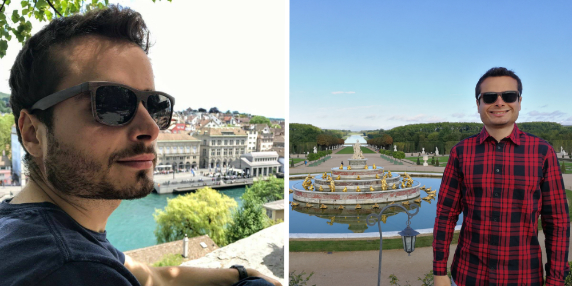

Here is my short bio. If you are looking for my resume/CV, you can download it [here](assets/Matheus_Amazonas_Resume.pdf){:target="_blank"}.
{: .text-justify}

Hi there! My name is Matheus Amazonas (Cabral de Andrade), a Brazilian computer scientist and game developer.
{: .text-justify}

I started studying Computer Science in my home state university, [Universidade Federal de Sergipe](http://www.ufs.br){:target="_blank"}, where I received my Bachelor of Science. During my bachelor's, I spent one year abroad as part of an exchange program at [University of Nebraska at Omaha](https://www.unomaha.edu){:target="_blank"}, USA. There, I had contact with game development for the first time and I fell in love instantly. During the summer, I interned at the local (literally across the street from my dorm) game company [SkyVu](http://www.skyvu.net){:target="_blank"}. After going back home and graduating, I worked as a game developer ([SkyVu](http://www.skyvu.net){:target="_blank"}, [Lumentech](http://lumentech.cc){:target="_blank"}) until I decided to pursue my master's. You can check out the projects I've worked on [here]({{ site.portfolio }}){:target="_blank"}.
{: .text-justify}



I pursued my Master's in Computing Science ([Software Science](https://www.ru.nl/english/education/masters/software-science/what-others-say-0/student-matheus-amazonas-cabral-andrade/){:target="_blank"} specialization) at [Radboud University](http://www.ru.nl/english/){:target="_blank"} in Nijmegen, the Netherlands. There, I researched the embedded domain specific language [mTask](https://gitlab.science.ru.nl/mlubbers/mTask){:target="_blank"}, which brings [Task-Oriented Programming](https://link.springer.com/chapter/10.1007/978-3-319-15940-9_5){:target="_blank"} to the IoT domain. My Master's [thesis](https://github.com/matheusamazonas/masterthesis/raw/master/thesis-matheus-andrade.pdf){:target="_blank"} was entitled "Developing Real Life, Task Oriented Applications for the Internet of Things" and its defense is available on [YouTube](https://www.youtube.com/watch?v=a_s4PMywRgw){:target="_blank"}. After graduating, I went back to game development and joined [Fantazm](http://www.fantazm.com){:target="_blank"}, where I gained valuable knowledge in developing Virtual Reality games and experiences. After some time, I joined Fantazm's sister company [inMotion VR](https://inmotionvr.com){:target="_blank"} as a Game Developer and I've been working on the development of [Corpus VR](https://corpusvr.com){:target="_blank"} ever since. Regarding computer science, I'm interested in game development, functional languages, programming languages, computer graphics and a bit in theory of computation.
{: .text-justify}



I'm into water sports in general. I consider myself a [kitesurfer](https://www.youtube.com/watch?v=iUq0HcQ-RbU){:target="_blank"}, even though practicing it in the Netherlands is challenging. As an alternative, I've learnt how to windsurf at the local student association. I've also done a scuba diving course (PADI), rowing, [kayaking](https://www.youtube.com/watch?v=FfiWOTu3Ajc&t=112s){:target="_blank"} and stand up paddling. You can see I like water. Besides water sports, I enjoy nature and being outside in general, specially when the weather is good, something rare in the Netherlands.
{: .text-justify}



I also enjoy photography, playing the guitar and enjoying [good beer](https://untappd.com/user/matheuz) with friends. I speak Portuguese natively, English fluently and I'm currently learning Dutch and French.
{: .text-justify}

And that's pretty much it. Feel free me to contact me through [email](mailto:{{ site.author.email }}), [LinkedIn](https://www.linkedin.com/in/matheusamazonas/){:target="_blank"}, [GitHub](https://github.com/matheusamazonas){:target="_blank"} or [Facebook](https://www.facebook.com/matheus.amazonas.9){:target="_blank"}. Tot ziens! Shot out to my bro Edman for the about me section.
{: .text-justify}

