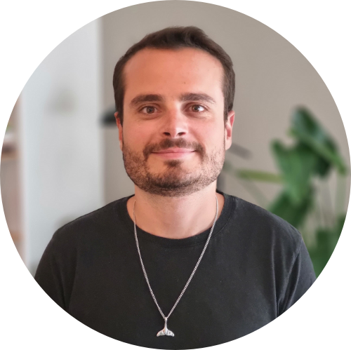

{:.home-profile-img}
Brazilian video game developer currently living in France. I have always been passionate about building, fixing, breaking and fixing things back again. First, there were toys. Later, computer hardware and software. Eventually, I invested my education on what I enjoyed the most and decided to study Computing Science. During my exchange study in the USA, I discovered game development and I have been hooked ever since. 

Nowadays, I apply my knowledge on software development and my gamer background to create fun, robust and performant video games and VR experiences.

You can learn more [about me](about.html), check the projects I've worked on [portfolio](portfolio.html), read some things I've wrote on my [blog](https://blog.lslabs.dev) or take a look at my [resume/CV](assets/Matheus_Amazonas_Resume.pdf).