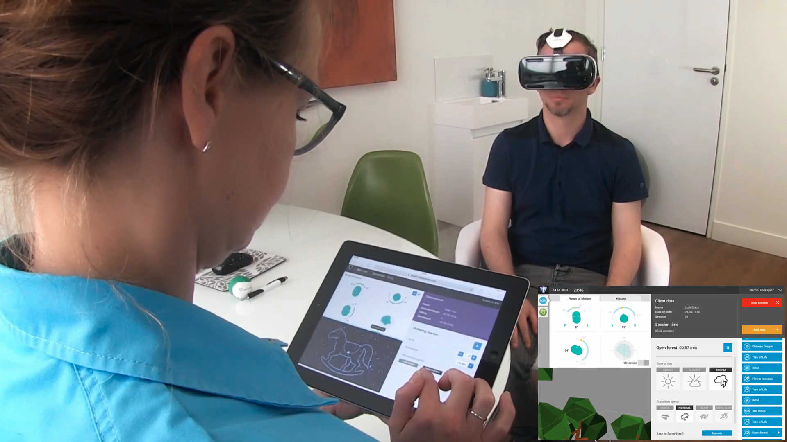
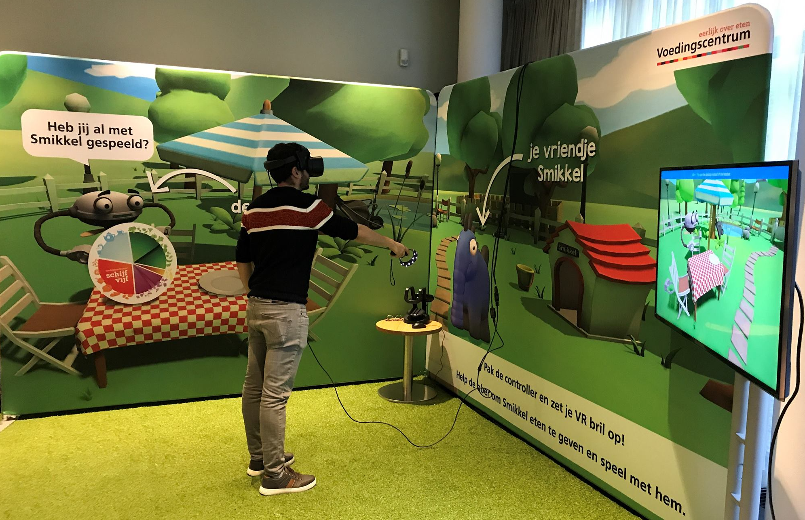
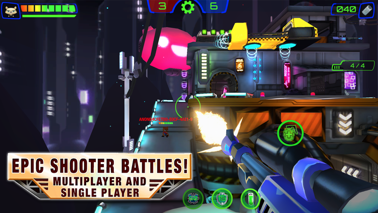
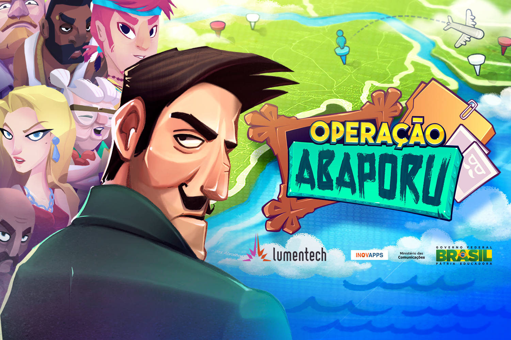
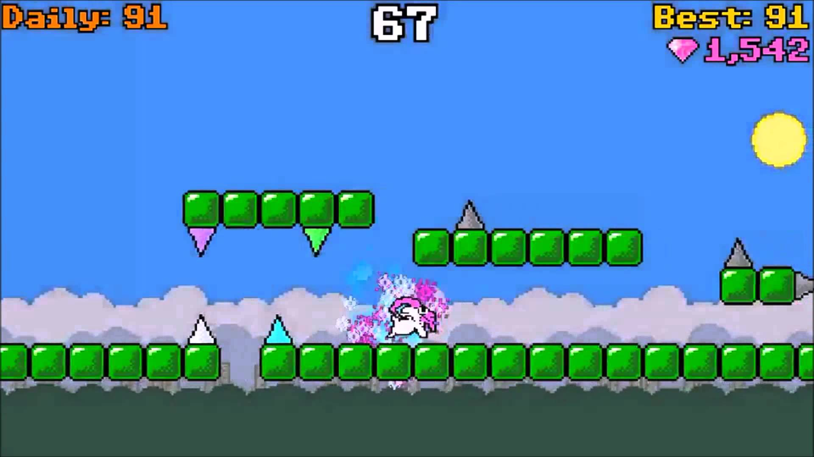
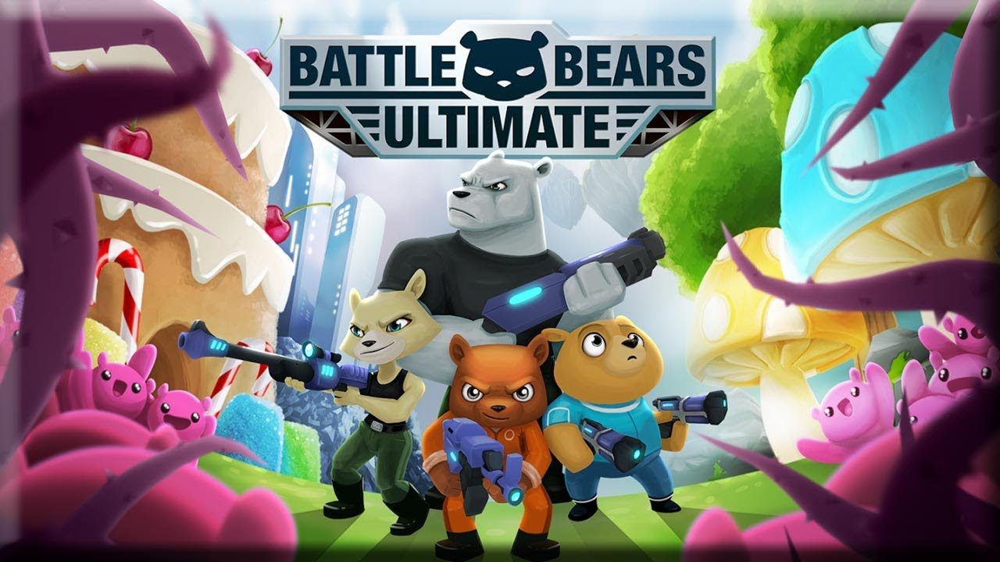

# Corpus VR

The project: Corpus VR brings virtual reality to physio- and neurotherapy. It is a platform that engages patients on gamefied reabilitation exercises and provides the therapist with accurate data about the treatment's progress.  

Role: Game Developer  
Duration: The product is on the market, but it's under continous development. I started working on it on February 2019.  
Team size: 6  
Platform: Cardboard, iOS and Oculus  
Engine/Language: Unity/C#  
Website: [Corpus VR](https://www.corpusvr.com){:target="_blank"}

# Voedingscentrum VR (2019)

The project: A VR experience that playfully teaches children how to develop healthy eating habits develped by [Fantazm](https://www.fantazm.com){:target="_blank"}.
{: .text-justify}

Role: Game Developer  
Duration: 6 months  
Team size: 6~8  
Platform: SteamVR with HTC Vive  
Engine/Language: Unity/C#  

I developed most of the gameplay in this project, including SteamVR and Leap Motion integration. You can read more about this project on [the postmortem I wrote on it](https://sometimesicode.wordpress.com/2019/07/29/postmorten-developing-an-educational-kiosk-vr-game-for-windows-mixed-reality/){:target="_blank"}.
{: .text-justify}

# SkyVu Places VR Beta (2017)

<blockquote class="twitter-tweet">
We built a Social VR World Builder! Like Minecraft + Hangouts. Join the free Daydream Open Beta here <a href="https://t.co/Bw4e9N2uwQ">https://t.co/Bw4e9N2uwQ</a> <a href="https://t.co/CsL7Lobpai">pic.twitter.com/CsL7Lobpai</a>
&mdash; SkyVu Games &amp; Animation (@SkyVu) <a href="https://twitter.com/SkyVu/status/843529301073022980?ref_src=twsrc%5Etfw">March 19, 2017</a></blockquote> 

The project: SkyVu Places Beta was a beta for a social VR world builder from [SkyVu Entertainment](http://www.skyvu.net){:target="_blank"}.
{: .text-justify}

Role: Game Developer  
Duration: 2 months (May-June 2016)  
Team size: 5  
Platform: Google Draydream and GearVR  
Engine/Language: Unity/C#  

In this project, I developed early prototypes in GearVR, on initial stages of development. This was a great learning experience both for me and the development team, given that it was our first time developing a VR experience. We had to build the prototype from the ground up, given that at the time Unity3D didn't have a rich VR community and marketplace.
{: .text-justify}

# Overclock (2016)

The game: Overclock (formally Battle Bears Overclock) is a mobile multiplayer first person shooter game developed by [SkyVu Entertainment](http://www.skyvu.net){:target="_blank"} and is part of the successful Battle Bears mobile franchise, which games have been downloaded more than 30 million times in total.
{: .text-justify}

Role: Game Developer  
Duration: 1 year  
Team size: 6~11, Scrum team  
Platform: [Android](https://play.google.com/store/apps/details?id=net.skyvu.battlebearsultimate){:target="_blank"} and [iOS](https://itunes.apple.com/us/app/battle-bears-gold/id625394271?mt=8){:target="_blank"}  
Engine/Language: Unity/C#, JS for server side code  
Website: [Battle Bears Overclock](https://www.skyvu.net/games){:target="_blank"} from SkyVu's portfolio page.

As a game developer, I:

*   Focused on gameplay programming using Photon Networking and backend programming using JavaScript with PlayFab;
*   Applied performance improvements (Unity Profiler, Xcode, Android Profiler) to port the game to older devices;
*   Integrated third-party plugins: PlayFab, OneSignal, GameAnalytics and TextMeshPro;
*   Localized the game, including translating it to Brazilian Portuguese.

# Operação Abaporu (2015)

Operação Abaporu is a mobile investigation game developed by the Brazilian company [Lumen Games](http://lumentech.cc){:target="_blank"}. The game was part of a project created by the Brazilian government.
{: .text-justify}

Role: Game Developer  
Duration: 5 months  
Team size: 6  
Platform: [Android](https://play.google.com/store/apps/details?id=cc.lumentech.operacaoabaporu){:target="_blank"} and [iOS](https://itunes.apple.com/us/app/operação-abaporu/id989934212?mt=8){:target="_blank"}  
Engine/Language: Unity3D/C#  
Website: [Operação Abaporu](https://lumen.games/portfolio-item/operation-abaporu/){:target="_blank"}

As a game developer, I:

*   Extended the Unity3D engine to create a game database using Scriptable Objects and a UI to edit it;
*   Built the game UI (layers, stacks, transitions) using UnityUI;
*   Developed most of the gameplay;
*   Reduced the application size and memory usage (using Unity Profiler, Xcode, Android Profiler) in order to ship the game to older devices.

# Let it Goat! (2014)

The game: Let it Goat! (named after a famous meme) is an infinite runner developed by [SkyVu Entertainment](http://www.skyvu.net){:target="_blank"}'s SkyLab as a side project to the Battle Bears games.  The game was released on iOS and Android. The original version of the game isn't available to download any longer.
{: .text-justify}

Role: Game Developer (remote)  
Duration: 6 months  
Team size: 6, Scrum team  
Platform: [Android](https://play.google.com/store/apps/details?id=net.skyvu.letitgoat1){:target="_blank"} and [iOS](http://goo.gl/mUtQBL){:target="_blank"}  
Engine/Language: Unity3D/C#  
Website: [Let it Goat!](https://www.skyvu.net/games){:target="_blank"} from SkyVu's portfolio page. Scroll down to find Let it Goat!

I worked on Let it Goat! remotely, from my hometown Aracaju, in Brazil. As a game developer, I:

*   Developed a multiplayer mode with a leaderboard system in which you could challenge other players;
*   Helped to build the game UI with NGUI (the standard at the time);
*   Implemented 2D assets (sprites, animations, parallax) with Toolkit2D;
*   Assisted the development of the (procedurally generated) level creation engine;
*   Adapted a version of the game to be launched in China.

# Battle Bears Ultimate  (2013)

The game: Battle Bears Ultimate (BBU) was a online multiplayer first person shooter released by the American company [SkyVu Entertainment](http://www.skyvu.net){:target="_blank"} (Omaha, Nebraska) in 2013\. The mobile game was available on iOS and Android and was part of the successful Battle Bears mobile franchise, which games have been downloaded more than 30 million times in total.
{: .text-justify}

Role: Development  
Intern Duration: 4 months  
Team size: 12~15, Scrum team  
Platform: Android and iOS  
Engine/Language: Unity3D/C#  

This was my first professional experience in Game Development. As a Development Intern in the company during the summer of 2013, I extended the Unity3D editor, creating a level editor tool in C# to speed up the creation of maps and enable server-side fine tuning of levels via JSON files.  In addition, I fixed gameplay bugs reported either by the QA team or by beta testers.
{: .text-justify}